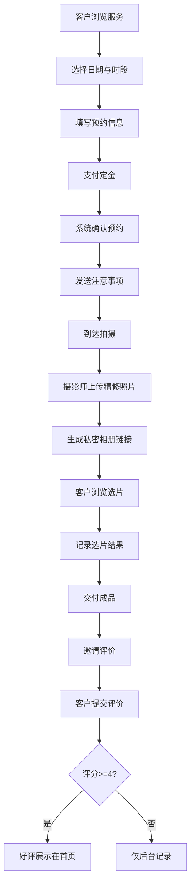

## 1. 产品概述

摄影工作室预约与档案管理系统，为摄影工作室提供从服务展示、在线预约、拍摄交付到客户关系管理的全流程数字化解决方案。目标用户为中小型摄影工作室的经营者、摄影师及预约客户。

- 解决传统摄影工作室预约混乱、沟通成本高、照片交付低效、客户档案缺失等痛点
- 通过线上化预约与定金支付减少爽约率，通过私密相册与选片系统提升交付效率，通过客户档案与评价系统增强复购与获客能力

## 2. 核心功能

### 2.1 用户角色

| 角色 | 注册方式 | 核心权限 |
|------|----------|----------|
| 工作室管理员 | 后台创建 | 管理服务、档期、价格、查看全部预约与客户档案 |
| 摄影师 | 管理员邀请 | 上传照片、查看分配客户的档案、添加拍摄备注 |
| 客户 | 自助注册 | 浏览服务、在线预约、支付定金、查看相册、选片、评价 |

### 2.2 功能模块

1. **首页**：工作室展示、服务概览、客户好评轮播、快速预约入口
2. **服务管理页**：拍摄服务CRUD、时长/价格/包含内容配置、淡旺季价格配置
3. **预约日历页**：日历视图展示空闲时段、在线预约流程、定金支付
4. **我的预约页**：预约列表、状态跟踪、注意事项查看
5. **私密相册页**：客户专属相册链接、精修照片浏览、在线选片
6. **客户档案页**：历次拍摄记录、偏好风格、摄影师备注
7. **评价系统页**：拍摄评价提交、好评展示
8. **管理后台页**：预约管理、档期管理、节假日价格配置、数据概览

### 2.3 页面详情

| 页面名称 | 模块名称 | 功能描述 |
|----------|----------|----------|
| 首页 | Hero横幅 | 工作室品牌展示、主视觉轮播、快速预约CTA按钮 |
| 首页 | 服务展示 | 四类拍摄服务卡片展示（证件照/写真/商业产品/婚纱预拍），含价格与时长 |
| 首页 | 好评轮播 | 精选客户好评滚动展示，含评分与评语 |
| 首页 | 工作室介绍 | 团队展示、设备展示、联系方式 |
| 服务管理页 | 服务列表 | 所有拍摄服务的卡片/列表视图，支持新增/编辑/删除 |
| 服务管理页 | 价格配置 | 每种服务的基础价格、淡旺季价格、节假日自动上浮比例配置 |
| 服务管理页 | 内容配置 | 每种服务包含的拍摄张数、精修张数、服装套数等 |
| 预约日历页 | 日历视图 | 月历展示可用时段，已约/空闲/节假日不同颜色标识 |
| 预约日历页 | 时段选择 | 点击日期展示当日可用时段列表 |
| 预约日历页 | 预约表单 | 选择服务类型、填写联系方式、确认预约信息 |
| 预约日历页 | 定金支付 | 显示定金金额，模拟支付流程 |
| 我的预约页 | 预约列表 | 按状态（待确认/已确认/已完成/已取消）分tab展示 |
| 我的预约页 | 预约详情 | 查看预约信息、注意事项（着装建议、到达路线） |
| 私密相册页 | 相册浏览 | 精修照片瀑布流/网格展示，支持放大查看 |
| 私密相册页 | 在线选片 | 勾选已选照片、显示已选/待修片数统计 |
| 客户档案页 | 档案总览 | 客户基本信息、历次拍摄时间线 |
| 客户档案页 | 偏好记录 | 客户风格偏好标签、摄影师备注 |
| 评价系统页 | 评价表单 | 评分（1-5星）、文字评价、标签选择 |
| 评价系统页 | 好评展示 | 高分评价卡片展示 |
| 管理后台页 | 数据概览 | 今日预约数、本月收入、待处理选片等关键指标 |
| 管理后台页 | 预约管理 | 全部预约的表格管理，支持状态变更 |
| 管理后台页 | 档期管理 | 设置不可用日期、节假日标记 |
| 管理后台页 | 价格日历 | 按日期配置淡旺季/节假日价格倍率 |

## 3. 核心流程

**客户预约流程**：客户浏览服务 → 选择日期时段 → 填写预约信息 → 支付定金 → 系统确认并发送注意事项 → 拍摄日到达拍摄

**照片交付流程**：拍摄完成 → 摄影师上传精修照片 → 系统生成私密相册链接 → 客户浏览并选片 → 系统记录选片结果 → 摄影师按选片结果交付成品

**评价流程**：拍摄完成/照片交付后 → 系统邀请评价 → 客户提交评价 → 好评自动展示在首页

## 4. 用户界面设计

### 4.1 设计风格

- 主色调：深炭黑(#1a1a1a) + 暖金(#C9A96E)，辅以象牙白(#FAFAF5)背景，营造高端摄影工作室质感
- 按钮风格：圆角(8px)，主按钮使用暖金渐变，hover时轻微上浮阴影
- 字体：标题使用 Playfair Display 衬线字体，正文使用 Noto Sans SC 无衬线字体
- 布局风格：卡片式布局、顶部导航、大量留白突出照片内容
- 图标风格：Lucide线性图标，线条细腻，与高端简约风格一致

### 4.2 页面设计概览

| 页面名称 | 模块名称 | UI元素 |
|----------|----------|--------|
| 首页 | Hero横幅 | 全屏背景图+暗色遮罩、居中大标题Playfair Display、暖金CTA按钮、缓慢视差滚动 |
| 首页 | 服务展示 | 4列等宽卡片、照片背景+暗色渐变覆盖、服务名称+价格浮层、hover放大效果 |
| 首页 | 好评轮播 | 横向滚动卡片、星级评分、客户头像、评语引用样式、自动轮播 |
| 服务管理页 | 服务列表 | 网格卡片布局、每个卡片含缩略图/名称/价格/时长、右上角编辑/删除图标 |
| 服务管理页 | 价格配置 | 侧边抽屉面板、基础价格输入框、淡旺季切换按钮、节假日上浮比例滑块 |
| 预约日历页 | 日历视图 | 7列月历网格、日期格内色块标识(绿色空闲/灰色已约/金色节假日)、点击弹出时段列表 |
| 预约日历页 | 预约表单 | 居中模态框、分步表单(选服务→选时段→填信息→支付)、进度条指示 |
| 我的预约页 | 预约列表 | Tab切换栏+时间线布局、每项含状态徽章(彩色圆点)、点击展开详情 |
| 私密相册页 | 相册浏览 | 瀑布流照片网格、照片hover显示放大镜图标、点击全屏查看+左右切换 |
| 私密相册页 | 在线选片 | 底部悬浮工具栏显示已选数量、照片右上角勾选框、已选照片金色边框高亮 |
| 客户档案页 | 档案总览 | 左侧基本信息卡片+右侧拍摄时间线、时间线节点含缩略图和日期 |
| 客户档案页 | 偏好记录 | 标签式风格偏好(可编辑)、备注文本域(摄影师可见) |
| 评价系统页 | 评价表单 | 5星点击评分、快捷标签(氛围好/专业/出片快等)、评语文本域 |
| 管理后台页 | 数据概览 | 4个统计卡片(今日预约/本月收入/待选片/好评率)+迷你折线图 |
| 管理后台页 | 预约管理 | 数据表格+筛选栏+状态快速切换下拉菜单 |
| 管理后台页 | 档期管理 | 月历视图+点击日期弹出配置弹窗(标记不可用/设置价格倍率) |

### 4.3 响应式设计

- 桌面优先设计，最小宽度1280px
- 平板适配(768px-1024px)：服务卡片2列、日历保持完整
- 移动端适配(<768px)：单列布局、底部导航栏替代顶部导航、日历简化为日期选择器
- 触控优化：按钮最小点击区域44px、相册滑动切换
