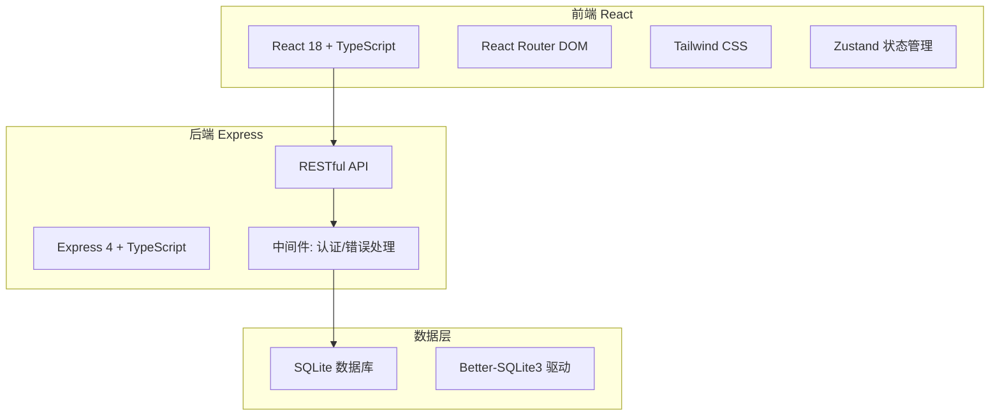
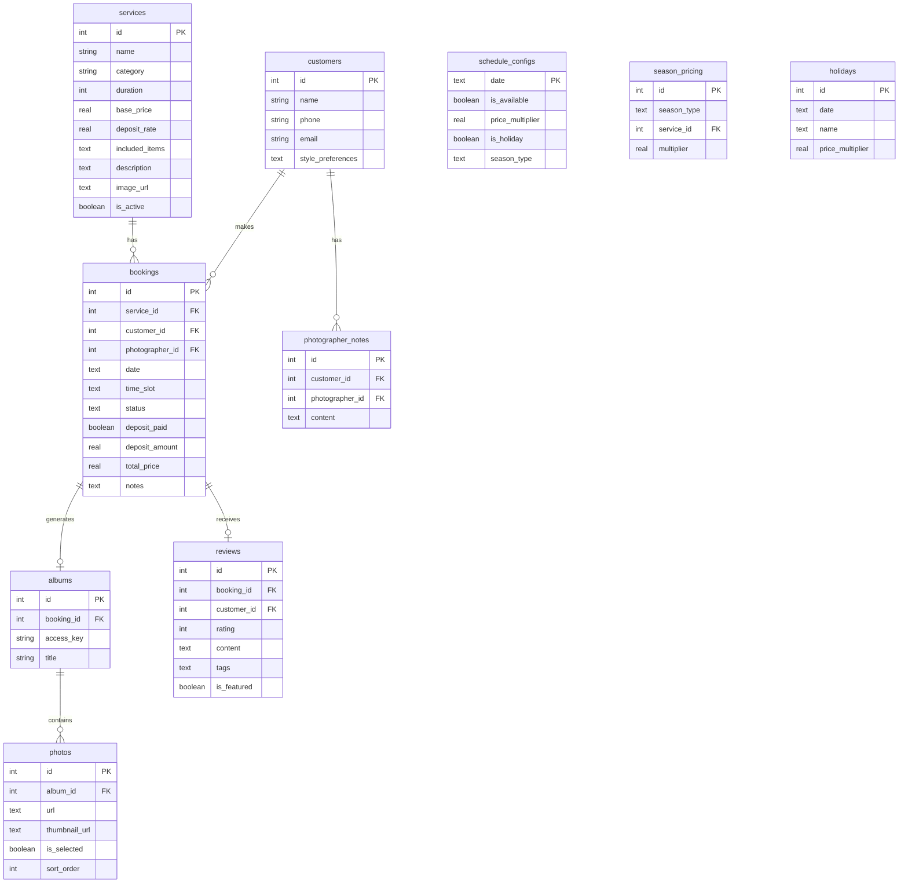

## 1. 架构设计



## 2. 技术说明

- 前端：React@18 + TypeScript + Tailwind CSS@3 + Zustand
- 初始化工具：vite-init
- 后端：Express@4 + TypeScript (ESM格式)
- 数据库：SQLite (Better-SQLite3)，使用本地文件存储
- 路由：React Router DOM v6
- 图标：lucide-react
- 字体：Playfair Display + Noto Sans SC (Google Fonts)

## 3. 路由定义

| 路由 | 用途 |
|------|------|
| `/` | 首页：工作室展示、服务概览、好评展示 |
| `/services` | 服务管理：拍摄服务CRUD与价格配置 |
| `/booking` | 预约日历：日历视图选择时段、在线预约 |
| `/my-bookings` | 我的预约：预约列表与状态跟踪 |
| `/album/:id` | 私密相册：照片浏览与在线选片 |
| `/profile/:id` | 客户档案：历次拍摄与偏好记录 |
| `/review/:bookingId` | 评价页面：提交拍摄评价 |
| `/admin` | 管理后台：数据概览、预约管理 |
| `/admin/schedule` | 档期管理：不可用日期与节假日配置 |
| `/admin/pricing` | 价格日历：淡旺季/节假日价格倍率配置 |

## 4. API定义

### 4.1 服务管理

```typescript
interface Service {
  id: number;
  name: string;
  category: "id_photo" | "portrait" | "commercial" | "wedding";
  duration: number;
  basePrice: number;
  depositRate: number;
  includedItems: string[];
  description: string;
  imageUrl: string;
  isActive: boolean;
  createdAt: string;
  updatedAt: string;
}

// GET /api/services - 获取所有服务
// GET /api/services/:id - 获取单个服务
// POST /api/services - 创建服务
// PUT /api/services/:id - 更新服务
// DELETE /api/services/:id - 删除服务
```

### 4.2 预约管理

```typescript
interface Booking {
  id: number;
  serviceId: number;
  customerId: number;
  photographerId?: number;
  date: string;
  timeSlot: string;
  status: "pending" | "confirmed" | "completed" | "cancelled";
  depositPaid: boolean;
  depositAmount: number;
  totalPrice: number;
  notes: string;
  createdAt: string;
  updatedAt: string;
}

// GET /api/bookings - 获取预约列表
// GET /api/bookings/:id - 获取预约详情
// POST /api/bookings - 创建预约
// PUT /api/bookings/:id - 更新预约状态
// GET /api/bookings/customer/:customerId - 获取客户预约
// GET /api/bookings/available-slots?date=YYYY-MM-DD - 获取可用时段
```

### 4.3 相册与选片

```typescript
interface Photo {
  id: number;
  bookingId: number;
  url: string;
  thumbnailUrl: string;
  isSelected: boolean;
  sortOrder: number;
  uploadedAt: string;
}

interface Album {
  id: number;
  bookingId: number;
  accessKey: string;
  title: string;
  photos: Photo[];
  selectedCount: number;
  totalPhotos: number;
}

// GET /api/albums/:accessKey - 通过私密链接访问相册
// POST /api/albums/:id/photos - 上传照片
// PUT /api/albums/:id/photos/select - 批量选片
// GET /api/albums/:id/selection-summary - 获取选片统计
```

### 4.4 客户档案

```typescript
interface CustomerProfile {
  id: number;
  userId: number;
  name: string;
  phone: string;
  email: string;
  stylePreferences: string[];
  shootingHistory: ShootingRecord[];
  photographerNotes: PhotographerNote[];
}

interface ShootingRecord {
  bookingId: number;
  serviceType: string;
  date: string;
  photoCount: number;
  selectedCount: number;
}

interface PhotographerNote {
  id: number;
  photographerId: number;
  content: string;
  createdAt: string;
}

// GET /api/customers/:id/profile - 获取客户档案
// PUT /api/customers/:id/profile - 更新客户偏好
// POST /api/customers/:id/notes - 添加摄影师备注
// GET /api/customers/:id/bookings - 获取客户历次拍摄
```

### 4.5 评价系统

```typescript
interface Review {
  id: number;
  bookingId: number;
  customerId: number;
  rating: number;
  content: string;
  tags: string[];
  isFeatured: boolean;
  createdAt: string;
}

// POST /api/reviews - 提交评价
// GET /api/reviews/featured - 获取精选好评(首页展示)
// GET /api/reviews/service/:serviceId - 获取某服务的评价
```

### 4.6 档期与价格

```typescript
interface ScheduleConfig {
  date: string;
  isAvailable: boolean;
  priceMultiplier: number;
  isHoliday: boolean;
  seasonType: "peak" | "off_peak" | "normal";
  timeSlots: TimeSlotConfig[];
}

interface TimeSlotConfig {
  startTime: string;
  endTime: string;
  isAvailable: boolean;
}

interface SeasonPricing {
  seasonType: "peak" | "off_peak" | "normal";
  serviceId: number;
  multiplier: number;
}

// GET /api/schedule?month=YYYY-MM - 获取月度档期
// PUT /api/schedule/:date - 更新某日档期配置
// GET /api/pricing/seasons - 获取淡旺季配置
// PUT /api/pricing/seasons - 更新淡旺季价格倍率
// GET /api/pricing/holidays - 获取节假日列表
// POST /api/pricing/holidays - 添加节假日及上浮比例
```

## 5. 服务器架构图


## 6. 数据模型

### 6.1 数据模型定义



### 6.2 数据定义语言

```sql
CREATE TABLE services (
  id INTEGER PRIMARY KEY AUTOINCREMENT,
  name TEXT NOT NULL,
  category TEXT NOT NULL CHECK(category IN ('id_photo', 'portrait', 'commercial', 'wedding')),
  duration INTEGER NOT NULL,
  base_price REAL NOT NULL,
  deposit_rate REAL NOT NULL DEFAULT 0.3,
  included_items TEXT NOT NULL DEFAULT '[]',
  description TEXT,
  image_url TEXT,
  is_active BOOLEAN NOT NULL DEFAULT 1,
  created_at TEXT NOT NULL DEFAULT (datetime('now')),
  updated_at TEXT NOT NULL DEFAULT (datetime('now'))
);

CREATE TABLE customers (
  id INTEGER PRIMARY KEY AUTOINCREMENT,
  name TEXT NOT NULL,
  phone TEXT,
  email TEXT,
  style_preferences TEXT NOT NULL DEFAULT '[]',
  created_at TEXT NOT NULL DEFAULT (datetime('now')),
  updated_at TEXT NOT NULL DEFAULT (datetime('now'))
);

CREATE TABLE bookings (
  id INTEGER PRIMARY KEY AUTOINCREMENT,
  service_id INTEGER NOT NULL REFERENCES services(id),
  customer_id INTEGER NOT NULL REFERENCES customers(id),
  photographer_id INTEGER REFERENCES customers(id),
  date TEXT NOT NULL,
  time_slot TEXT NOT NULL,
  status TEXT NOT NULL DEFAULT 'pending' CHECK(status IN ('pending', 'confirmed', 'completed', 'cancelled')),
  deposit_paid BOOLEAN NOT NULL DEFAULT 0,
  deposit_amount REAL NOT NULL DEFAULT 0,
  total_price REAL NOT NULL DEFAULT 0,
  notes TEXT,
  created_at TEXT NOT NULL DEFAULT (datetime('now')),
  updated_at TEXT NOT NULL DEFAULT (datetime('now'))
);

CREATE TABLE albums (
  id INTEGER PRIMARY KEY AUTOINCREMENT,
  booking_id INTEGER NOT NULL REFERENCES bookings(id),
  access_key TEXT NOT NULL UNIQUE,
  title TEXT NOT NULL,
  created_at TEXT NOT NULL DEFAULT (datetime('now'))
);

CREATE TABLE photos (
  id INTEGER PRIMARY KEY AUTOINCREMENT,
  album_id INTEGER NOT NULL REFERENCES albums(id),
  url TEXT NOT NULL,
  thumbnail_url TEXT,
  is_selected BOOLEAN NOT NULL DEFAULT 0,
  sort_order INTEGER NOT NULL DEFAULT 0,
  uploaded_at TEXT NOT NULL DEFAULT (datetime('now'))
);

CREATE TABLE reviews (
  id INTEGER PRIMARY KEY AUTOINCREMENT,
  booking_id INTEGER NOT NULL REFERENCES bookings(id),
  customer_id INTEGER NOT NULL REFERENCES customers(id),
  rating INTEGER NOT NULL CHECK(rating BETWEEN 1 AND 5),
  content TEXT,
  tags TEXT NOT NULL DEFAULT '[]',
  is_featured BOOLEAN NOT NULL DEFAULT 0,
  created_at TEXT NOT NULL DEFAULT (datetime('now'))
);

CREATE TABLE schedule_configs (
  date TEXT PRIMARY KEY,
  is_available BOOLEAN NOT NULL DEFAULT 1,
  price_multiplier REAL NOT NULL DEFAULT 1.0,
  is_holiday BOOLEAN NOT NULL DEFAULT 0,
  season_type TEXT NOT NULL DEFAULT 'normal' CHECK(season_type IN ('peak', 'off_peak', 'normal'))
);

CREATE TABLE photographer_notes (
  id INTEGER PRIMARY KEY AUTOINCREMENT,
  customer_id INTEGER NOT NULL REFERENCES customers(id),
  photographer_id INTEGER NOT NULL REFERENCES customers(id),
  content TEXT NOT NULL,
  created_at TEXT NOT NULL DEFAULT (datetime('now'))
);

CREATE TABLE season_pricing (
  id INTEGER PRIMARY KEY AUTOINCREMENT,
  season_type TEXT NOT NULL CHECK(season_type IN ('peak', 'off_peak', 'normal')),
  service_id INTEGER NOT NULL REFERENCES services(id),
  multiplier REAL NOT NULL DEFAULT 1.0
);

CREATE TABLE holidays (
  id INTEGER PRIMARY KEY AUTOINCREMENT,
  date TEXT NOT NULL UNIQUE,
  name TEXT NOT NULL,
  price_multiplier REAL NOT NULL DEFAULT 1.0
);

CREATE INDEX idx_bookings_date ON bookings(date);
CREATE INDEX idx_bookings_customer ON bookings(customer_id);
CREATE INDEX idx_bookings_status ON bookings(status);
CREATE INDEX idx_albums_access_key ON albums(access_key);
CREATE INDEX idx_photos_album ON photos(album_id);
CREATE INDEX idx_schedule_date ON schedule_configs(date);
CREATE INDEX idx_holidays_date ON holidays(date);
```
